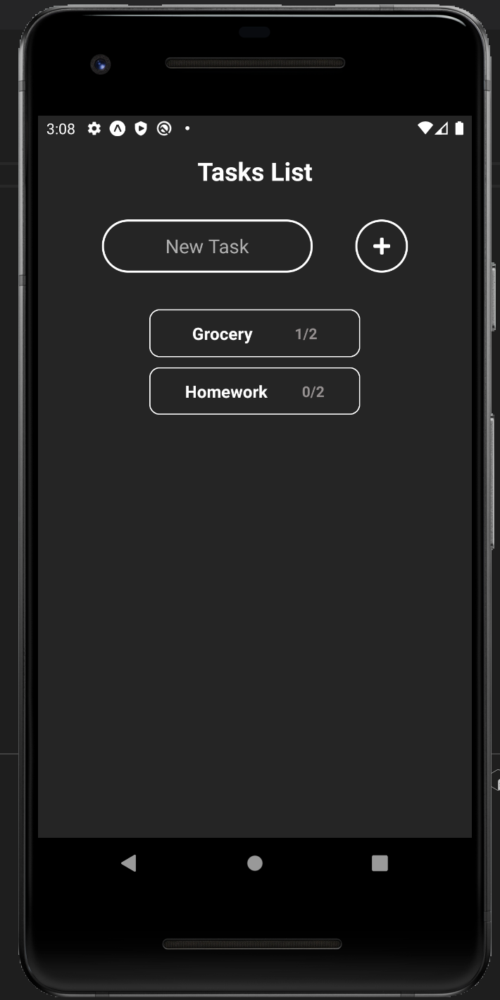
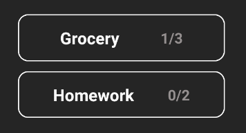
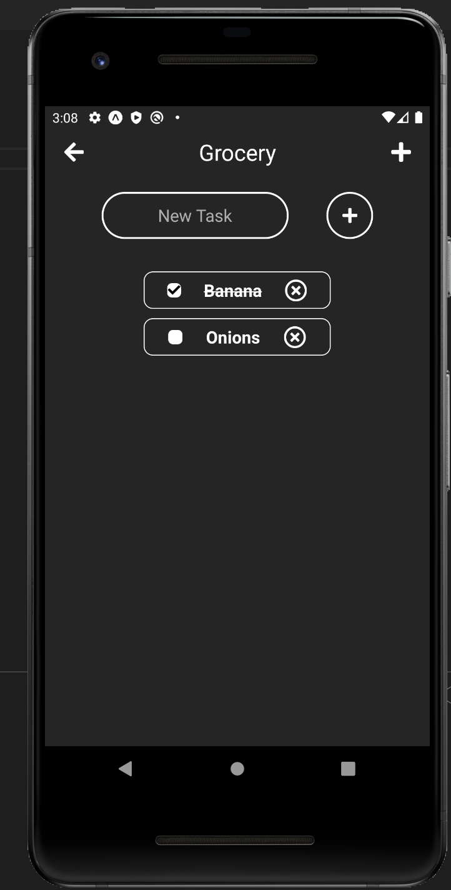
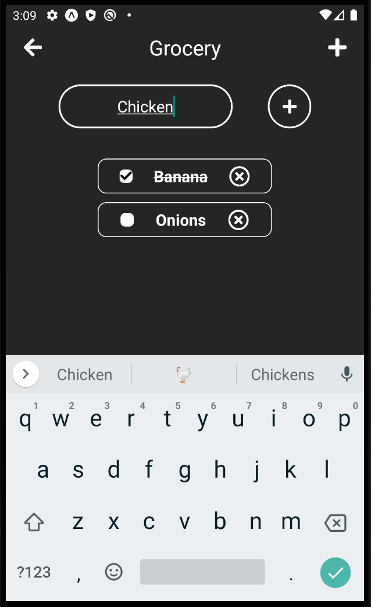

# Todo/Checklist Mobile Application

The goal of this project is to increase my knowledge of React Native and mobile design/engineer. A todo/checklist application will help my understand react native and mobile applciation structure better. This application allows me to learn different technique about saved data between different screens/states.

## Skills

With this project, I attended to learn some tools/skills for professional use:

- React Native
- Mobile Design
- Data structure

## Experience

This project was easy comparatively to PomdoroApp. This project is intended to be put onto my resume to showcase fundamental ability of creating a mobile application using React Native. I started with the application structure and checklist data structure. Task object is created per list, and has a id, array of todos, and title. 

## Future

- Delete function for task
- Save all task onto local storage when program exit
